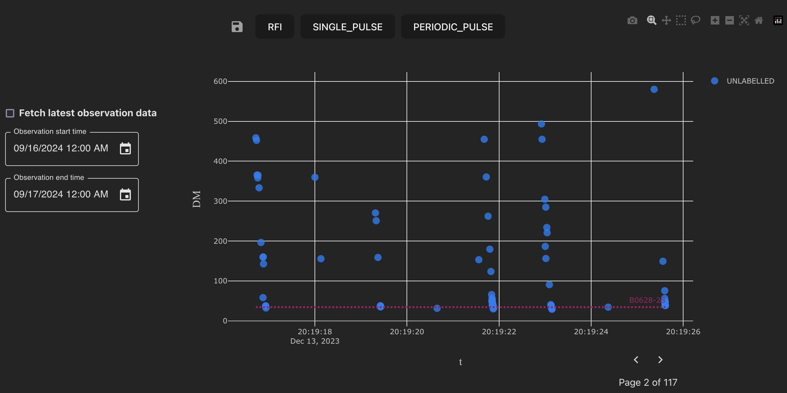
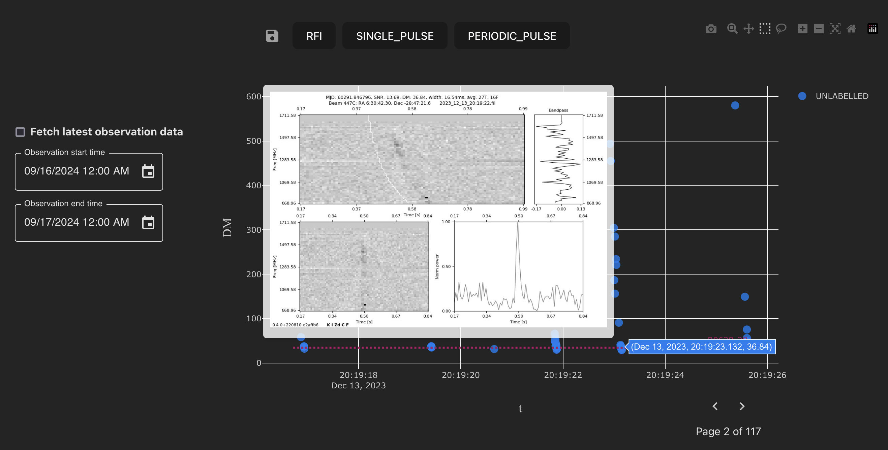

========
Overview
========

The single pulse labeller provides an interface to label single pulse "candidates" as either Radio Frequency Interference (RFI), a single pulse of radio emission, or as a pulse of radio emission likely produced by a known pulsar.

An example view of the single pulse labeller is shown below.

   Single pulse labeller.

Each point on the chart is a candidate. In general, candidates are short bursts of radio emission detected by a telescope. Currently, all MALTOPUFT candidates are detected by the MeerTRAP single pulse search pipeline. There are plans to support the ingestion of data archives from other telescopes in the future.

The MeerTRAP single pulse search pipeline measures several properties of the detected pulse, including the `Dispersion Measure <https://astronomy.swin.edu.au/cosmos/P/Pulsar+Dispersion+Measure>`_ (DM) which is the integrated column density of free electrons between an observer (in this case, the telescope) and the source of the radio emission.

The single pulse labeller is a 2D scatter plot of the DM against observation time. Plotting candidates in this way allows classification decisions to be made based on clusters or patterns in candidates. For example, a series of candidates observed at a constant DM may belong to a periodic emitter such as a pulsar. By contrast, a group of candidates observed with different DM at the same time indicates that the signals are likely RFI.

In addition to patterns in groups of candidates, diagnostic subplots for individual candidates can be used for classification. A candidates' diagnostic subplot is displayed while hovering over the candidate. 

   Diagnostic subplots are displayed while hovering over candidates.

These plots suggest that the candidate is a true single pulse, such that the candidate can be labelled as a single pulse or known source. In this particular case, the candidate is located in the same patch of sky and has the same DM as the known pulsar ``PSR B0628-28``, suggesting that the candidate is a known source.

.. note::

    An explanation of how to use diagnostic subplots to make classification decisions is out of scope for this overview.

The dashed horizontal line (constant DM) on the chart is a *known source* (in the example screenshot above, the pulsar ``PSR B0628-28``). Known sources are retrieved if they fall in a cone with radius 1 degree around the centre of the observation. Overlaying known sources assists with identifying whether pulses may have been emitted by a known or unknown source.
