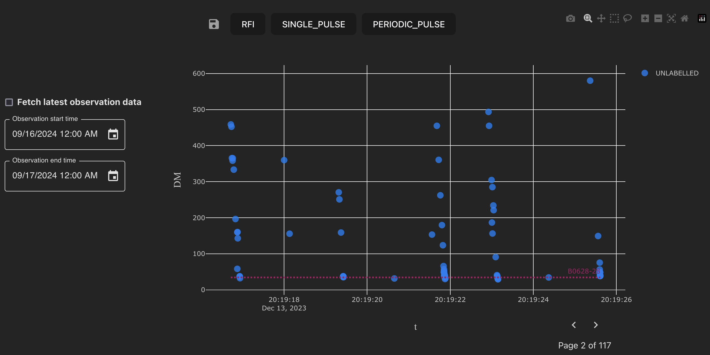

=====
Usage
=====

This documentation introduces the key features and usage of the MALTOPUFT single pulse labeller.

An example view of the single pulse labeller is shown below.

   Single pulse labeller.

Candidate selection options
===========================

The left-hand side toolbar provides options for selecting candidates of interest.

   Candidate selection options.

Clicking the ``Fetch latest observation data`` checkbox loads all candidates from the most recent observation. Selecting a date range loads all candidates observed at any point during observations which *overlap* with the selected date range.

.. note::

    Candidates outside of the selected date range will be loaded if the range includes observations whose start time preceeds or end time exceeds the selected date range.

Tools and features
==================

Once candidates of interest have been loaded, the labeller toolbar can be used to choose from several operations such as zoom, pan and box select. 

   Interactive labeller tools. A tooltip displays an explanation of the tool while hovering.

Zoom
----

Let's select the zoom tool from the toolbar and select some candidates that were observed with a dispersion measure similar to that of the plotted known source.

   Selecting a subset of candidates with the zoom tool (`top`) and the zoomed view of the selected candidates (`bottom`).

.. tip::

    To reset the axes you can either click the `Reset axes` button on the chart toolbar or double click anywhere on the chart (with the zoom tool selected). Double-clicking the chart with another tool enabled will not reset the axes.

    Similarly, any interactive changes made to the chart, such as candidate selections, can be undone by double-clicking the chart with the same tool selected.

Diagnostic subplots
-------------------

Examining a few diagnostic subplots displayed when hovering over candidates suggests that the candidates centered around the DM of the known pulsar are likely to be real pulses.

   Example diagnostic subplots for a candidate (`top`) and a larger version of the plot (`bottom`). The top-left plot is a 3D histogram of the observed frequency vs. time where the third dimension is the intensity of the radio emission. The top-right plot is ... . The bottom-left plot is the frequency vs. time histogram after de-dispersion at the fitted DM. The bottom-right plot is a "scrunched" version of the de-dispersed frequency vs. time histogram which is computed by integrating the intensity over all frequencies.

By contrast, candidates with larger DM do not appear to be real radio pulses. This candidate is likely to RFI.

   Diagnostic subplots for an RFI candidate.

This single candidate can be selected with a click. After selection, the RFI label can be assigned and the label saved by pressing the ``Save`` icon.

   A candidate labelled as RFI with the ``Save`` button highlighted.

.. note::

    When a selection is made, the opacity of the candidates outside the selection is reduced. The darker candidates outside of the selection in the plot above indicate that many candidates are overlayed, increasing the opacity.

.. tip::

    Saved labels can be updated. If you change your mind about a label you have assigned, you can update the label and save it.

Known sources
-------------

In the previous section, it was identified from the diagnostic subplots that candidates clustered around the same DM as pulsar ``B0628-28`` are likely to be real radio pulses. However, should these candidates be labelled as a new single pulse or known pulsar?

To understand this, we can consider the properties of pulsar ``B0628-28``. The `ATNF pulsar catalogue <https://www.atnf.csiro.au/people/pulsar/psrcat/psrcat_help.html>`_ records a period of 1.24 ms and DM of 34.4 kpc cm^-3. From the chart, we can immediately identify that the clusters of radio emission occur at a similar DM and occur with a period of around 1.2 ms. We can be confident that these candidates originated from a known pulsar.

.. tip::
    
    Known source information cards will be available within the application in the future, so there will soon be no need to look this information up from external sources.

Bulk candidate selection
------------------------

Now, let's select the ``Box select`` tool and select the candidates with DM close to the known source. The candidates can be labelled as a known pulsar, and the labels saved.

   Selecting a group of candidates with the box select tool.

.. note::

    For more complex selections with arbitrary shape, a "lasso" selection tool is also available.
